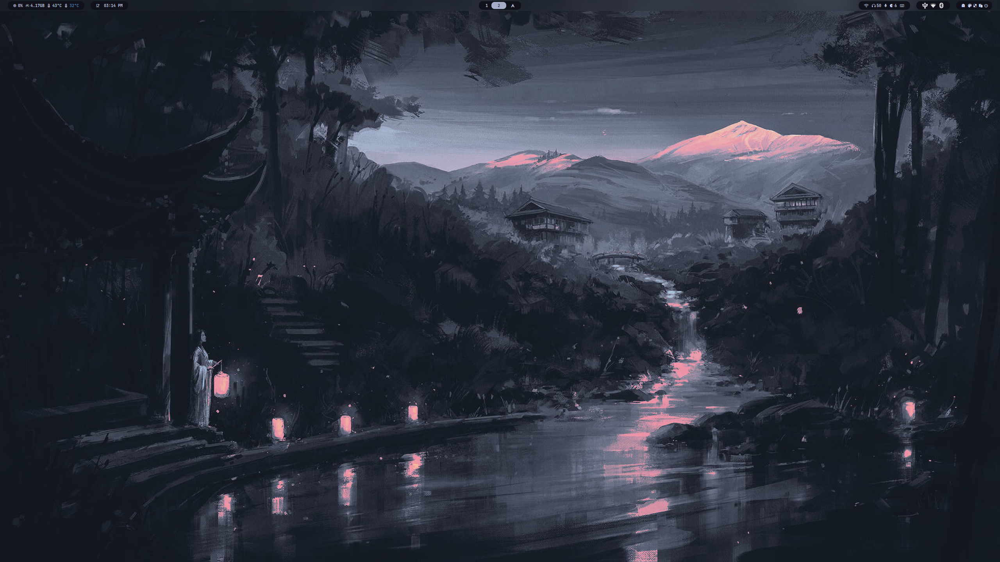
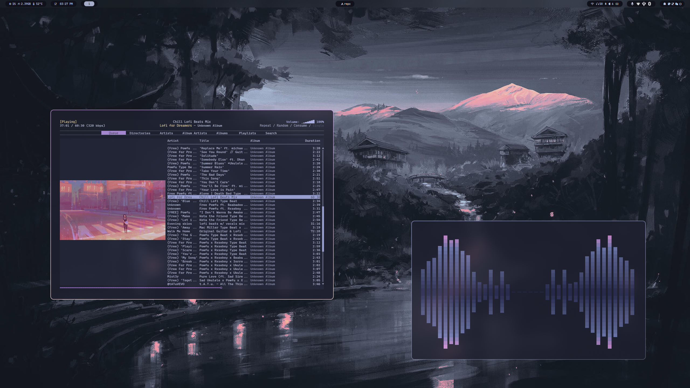

## Screenshots

### Hyprland Desktop



### Cava & Music Player



# Dotfiles

This repository contains my personal configuration files for various tools and environments, including:

- **Hyprland**: Wayland compositor
- **Waybar**: Wayland status bar
- **Kitty**: Terminal emulator
- **Alacritty**: Terminal emulator
- **Hyde**: Theme manager
- **Bash/Zsh configuration**: Shell setup
- **Cava**: Music Visualizer
- **Fastfetch**: Terminal Information
- **Gammastep**: Bluelight/Brightness Filter
- **Nvim/Lazyvim** Edtior/File Browser
- **RMPC/NCMPCPP** Music Player

## Getting Started

To use these dotfiles: Please start with HyDE's Dotfiles https://github.com/HyDE-Project/HyDE

## 🛠️ Manual Install

If you want to manually install these dotfiles:

```bash
# Clone the repository
git clone https://github.com/PrawnBalls/dotfiles.git ~/dotfiles

# Move into the dotfiles directory
cd ~/dotfiles

# Run the installer
chmod +x install.sh
./install.sh
